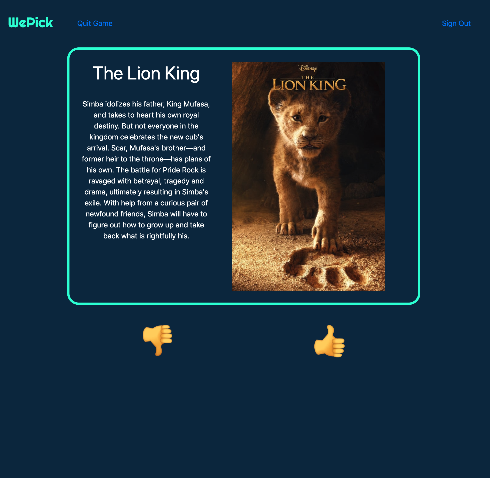
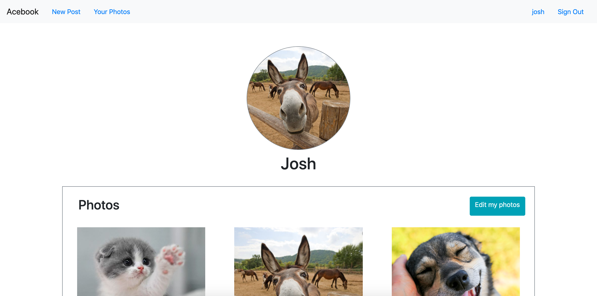
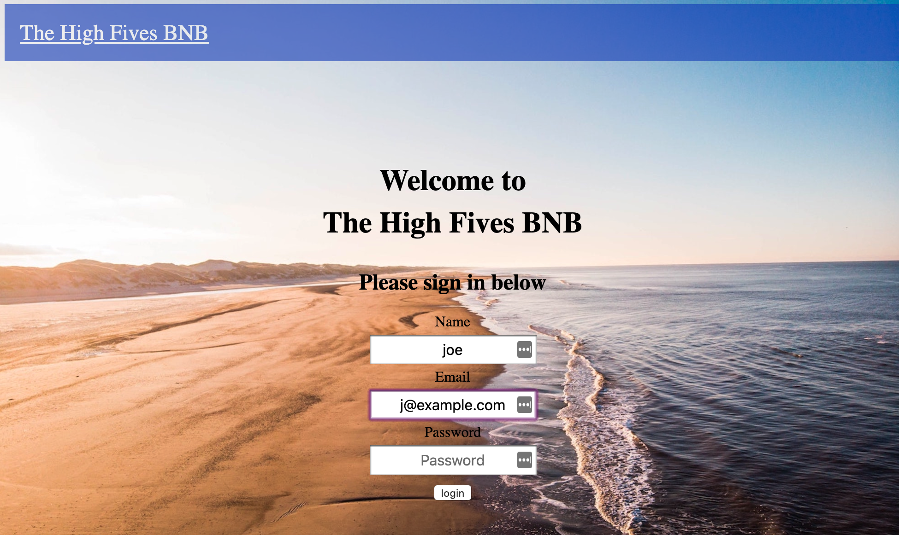

<h1></h1>
 <h4 align="right">email&nbsp;:&nbsp;<a href="mailto:joeellingworth@gmail.com">Joe Ellingworth</a>&nbsp;&nbsp;&nbsp;&nbsp;&nbsp;</h4>
  

# Joe Ellingworth
I graduated from Makers Academy in April 2020 where I spent the 16 weeks learning hard and fast about the fascinating world of code while becoming a full stack developer. I'm passionate about all things tech. 
 
Who am I? Let me tell you my story. Well, university wasnt for me. Instead I needed to get out and grab the world. Starting in marketing in Mumbai, India, I progressed and developed myself while working in many extraordinary places. I eventually became the manager of a department in Batu Batu, the renowned high end tourist resort in Malaysia. On my way there I qualified as a scuba dive instructor and taught in Thailand, The Maldives, Costa Rica and Japan. 

Looking for something more settled I moved to Mexico and that is where I got bitten by the tech bug while working as a Computer Network Technician. I cant believe it took me that long! I returned to the UK last year to entirely refocus my career on software development. Whilst waiting for entry onto the Makers Academy, I taught myself to code while troubleshooting others’ tech problems to earn my living.I confidently tell you my story because it demonstrates I have energy, tenacity, resilience, courage, independence and yet I can adapt easily and work best in teams whilst being a natural leader, or follower, as required.

**Please expand the drop downs below by clicking on them**

Projects

| Project Name        |Overview           |Tech Stack      |
|:-----------:|:-------------------------------:|:-----------------------------:|
|  [WePick](https://github.com/jasylwong/wepick) | An app that solves the age old problem of  agreeing which movie you and your mate both want to watch. Our Final group project at Makers and incorporating multiple APIs            |Ruby on Rails, Sinatra, CSS, HTML, RSpec, Capybara and PSQL  |
|WePick2        |A redesign of our original WePick App. Focusing on expanding the concept with new features and new tech stack.            |       React Native, Javascript, NodeJs, Jasmine, Jest, HTML, CSS| 
|  [Acebook](https://github.com/Peter2-71828/aceBook-PingPong)         |A simple social networking site where users can upload posts and images and interact with other users.| Ruby on Rails, Sinatra, CSS, HTML, RSpec, Capybara and PSQL | https://github.com/Peter2-71828/aceBook-PingPong |
|  [MakersBNB](https://github.com/Peter2-71828/MakersBNB)   | A simple replica of AirBnB. Users can sign up, list properties, view other properties and make bookings. This was our first Makers group project.|Ruby, Sinatra, CSS, HTML, RSpec, Capybara and PSQL | https://github.com/Peter2-71828/MakersBNB |

 

Skills

I am a fast learning logical thinker and resourceful team player. I am known as someone who rolls up my sleeves and gets stuck in. I am quietly confident and well rounded. I fall back on the life skills I honed around the world in a variety of roles and settings. Above all I am passionate about coding and problem solving.

### Fast learning adaptable team player

Before I found my passion for coding I worked in several different countries, cultures and settings, always successful in the roles I took on. As evidence of my fast learning, I was promoted to a manager role after having been a scuba diving instructor for a relatively short time. I was hired as the Manager of the Dive and Activity Department at Batu Batu Resort in Malaysia where I successfully managed a team of 6 and a budget of £150,000.

I achieved these rapid promotions through being an adaptable team player, a natural team leader, hard working, fast learning, always willing to take on extra responsibilities. Working in remote island resorts with limited external support to call on is testing, and it creates the conditions which forces you to fall back on your own problem solving and I became very resourceful.

### Hard working, well rounded and passionate about Tech

I was introduced to the tech industry while living in Mexico. I became a Computer Network Technician for Baja Connect. It was a learn-fast-high-pressured rollercoaster but I found that I excelled in it. I learnt a lot in a short time but the two most important things I learnt was I) I love troubleshooting and 2) I'm fascinated about tech.

 

Education

## Makers Academy (Dec 2019 to April 2020)
Fully immersive 16 week programming course at Europe’s #1 Developer Bootcamp focused on core coding techniques & principles such as agile methodologies, Test Driven Development (TDD), Object Oriented Design, pair programming and more.
 
#### Core course topics:
Object Oriented Design (OOP) best practices,
Test Driven Development (TDD),
writing clean code,
Pair Programming ,
Agile development as well as core principles such as dependency injection, single responsibility,
cohesion and encapsulation,
 
#### Languages and Frameworks:
 
##### Languages
- Ruby
- JavaScript
- HTML / CSS (Including CSS FlexBox & CSS Grid)
 
##### Frameworks 
- React Native
- Node.JS
- Ruby on Rails
- Sinatra
 
##### Testing Suites
-  RSpec (Ruby)
- Capybara (Ruby / JavaScript)
- Jasmine (JavaScript)
- Jest (JavaScript)
- Enzyme (React)
 
##### Git Workflow
- Using branches to work collaboratively in teams
- Writing descriptive & succinct commit messages
- Enforcing good commit discipline to minimise code conflicts
- Dealing with code conflicts
 
##### Databases
- PostgreSQL
- SQLite
 
##### Deployment
Continues deployment of the master and development branches using Heroku.
 
##### Working Methodology
- Agile software development including:
   - XP values
   - Sprint planning
   - Pair programming
   - Breaking down the program into user stories
   - Breaking down the user stories further into tickets
   - Daily stand-ups and retrospectives to iteratively improve processes and code
   - Technologies learnt;
### PADI Master Scuba Diver Trainer
This intensive qualifying course prepares you to take responsibilities for the lives of others. Beyond the extensive and complex technical knowledge required you have to have people skills, be cool under fire and adaptable to new environments such as the underwater world where a dash to the safety of the surface can kill.
### Milton Abbey 2006 - 2011
A levels: History, History Of Art, Religious studies and Communication Studies
9 GCSEs

 

Experiences

**Joe's Tech Support** (April 2018 to Present)

*Self employed general all purpose IT support and  troubleshooter*
A large variety of jobs in many aspects of tech eg:
- Management of home networks
- Troubleshooting problems big and small
- Managing social media accounts, notably Emu Electic Bikes
- Website and domain management
 

 **Baja Connect** (July 2018 to April 2019)

*Field Agent*
- Learnt the trade of networking
- Installed, configured and maintained point to multipoint wireless WAN networks for a variety of clients (Ubiquiti airMAX)
- Planned, installed, configured and managed home and professional mesh LAN networks (Ubiquiti Unifi & Amplifi)
- Configured and managed standard home networks via 802.11N and 802.11AC routers (TP link, Cisco)
- Installed and managed pre-sliced fiber optic hybrid systems to client side (Ubiquiti UFiber)
- Installed, configured and managed home security equipment. (Ubiquiti UnifiVideo & Ring )
- Troubleshooting in all areas of the business. Client side and Server Rooms
 
 

**Batu Batu Resort** (Jan 2016 - Nov 2016)

*Head of Dive and Activity Department*
- Managed a team of 6 and a budget of £150,000
- Responsible for all Water related Activities and safety of a private island resort
- Most qualified lifesaver and first Aider on a remote island
- Responsible for the upkeep of the three island Speedboats
- Maintained a full working dive shop include equipment, tanks and high maintenance Compressor
 

**PADI SCUBA Instructor** (2014 - 2016)
*Master Scuba Diver Trainer (MSDT)*
- Learnt to work under pressure
- Managing nervous people in potentially dangerous situations
- Client service in high end resorts eg The Four Seasons Maldives

 

Hobbies

I renovated my dilapidated 1969 Airstream land yacht trailer, a steep learning curve demonstrating resourcefulness, resilience and patience but not much aptitude. (Photos proudly supplied upon request)
Recycling scrap materials to make home aquaponics systems (aquaculture - hydroponic combinations), an innovative water and energy efficient method of growing food in  and if i'm not doing that you can find me getting my hands dirty in the ground planting some veggies.
People seek me out to join their projects. I am blessed with a wide and wonderful circle of friends and family, and I love cats but most of all I love my dog Bentley

 
